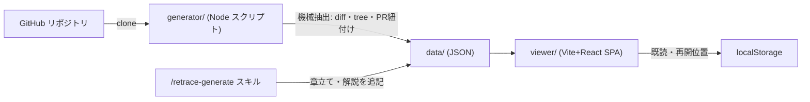

# retrace — OSS コミット履歴の追体験ツール 設計書

OSS リポジトリの歴史を最初のコミットから順に「差分 + LLM による意図の解説」付きで読み進められる、自分専用のローカル学習ツール。

## 決定事項(グリルセッション 2026-07-22 の結論)

| 論点 | 決定 |
|---|---|
| 利用者 | 自分専用ローカルツール。認証・共有・ホスティングなし |
| 題材第1号 | [nakabonne/ali](https://github.com/nakabonne/ali)(Go, mainline 約280コミット, PR 75件, bot コミット0件) |
| 対象範囲 | 全コミット(小規模リポジトリを選ぶことで「初期N件」制約を不要化) |
| 価値の核 | **LLM による意図の解説**。UI・進捗管理は補助 |
| 意図の源泉 | PR 本文・リンクされた issue + 前後の文脈。PR に紐づかないコミットは**推測と明示**(evidence バッジ) |
| 解説の生成経路 | Claude Code セッション内(スキル `/retrace-generate`)。サブスク内で完結、API 従量課金なし |
| 解説の実行モデル | 章立て=セッションモデル、コミット解説バッチ=sonnet サブエージェント |
| 構造 | LLM による章立て + 全コミット個別解説 |
| 解説の形 | 定型フォーマット(何を/なぜ/読みどころ/根拠)。行アンカー注釈は v2 |
| 配信形態 | 静的生成 + SPA。ジェネレーターが JSON を焼き、ビューアは fetch するだけ |
| ビューアスタック | Vite + React + TypeScript |
| 進捗管理 | localStorage。コミット単位既読(開いたら自動既読 + 手動トグル)+ 最終閲覧位置から再開 |
| 対象リポジトリの選定基準 | 初期から PR 駆動の中小規模 OSS を優先。PR 不在コミットは推測フォールバック |

## アーキテクチャ



- **generator/** … 決定的な機械抽出。git と `gh` CLI だけで動く Node(ESM)スクリプト群。LLM は使わない
- **.claude/skills/retrace-generate/** … Claude Code スキル。抽出済み JSON に章立てと解説を追記する(ここだけ LLM)
- **viewer/** … 純粋な静的 SPA。`data/` の JSON を読むだけ。サーバーロジックなし
- **data/** … リポジトリごとの生成データ(**git 管理**。機械抽出は再生成可能だが、解説は生成にコストがかかるため保全する。2026-07-22 変更)

## データスキーマ

パス規約: `data/<owner>__<repo>/`(例: `data/nakabonne__ali/`)

### data/datasets.json(全データセットの目次)

```json
[{ "id": "nakabonne__ali", "owner": "nakabonne", "repo": "ali", "commitCount": 200 }]
```

### repo.json

```json
{
  "owner": "nakabonne", "repo": "ali",
  "url": "https://github.com/nakabonne/ali",
  "defaultBranch": "master",
  "headSha": "…", "mainlineCount": 200,
  "extractedAt": "2026-07-22T00:00:00Z"
}
```

### index.json(ビューアが最初に読む一覧)

```json
{ "entries": [{
  "seq": 1, "sha": "…", "subject": "Initial commit",
  "authorName": "nakabonne", "authorDate": "2020-09-12T00:11:21Z",
  "prNumber": null, "filesChanged": 3, "additions": 120, "deletions": 0,
  "hasExplanation": false
}] }
```

### chapters.json(スキルが生成。存在しない間、ビューアは「未生成」表示)

```json
{ "chapters": [{
  "id": 1, "title": "プロジェクトの立ち上げ",
  "summary": "CLI の骨格と attacker の原型を作った時期。…",
  "startSeq": 1, "endSeq": 18
}] }
```

### commits/&lt;seq 4桁&gt;-&lt;sha 先頭7桁&gt;.json(例: `commits/0001-a1b2c3d.json`)

```json
{
  "seq": 1, "sha": "…", "parents": ["…"],
  "author": { "name": "…", "email": "…", "date": "…" },
  "message": "コミットメッセージ全文",
  "pr": { "number": 12, "title": "…", "body": "…", "url": "…" },
  "linkedIssues": [{ "number": 3, "title": "…", "body": "…", "url": "…" }],
  "stats": { "filesChanged": 2, "additions": 40, "deletions": 3 },
  "files": [{ "path": "main.go", "status": "M", "additions": 40, "deletions": 3, "binary": false }],
  "diff": "unified diff テキスト全文",
  "diffTruncated": false,
  "tree": ["main.go", "go.mod", "…このコミット時点の全ファイルパス…"],
  "explanation": null
}
```

- `pr` / `linkedIssues` は無ければ `null` / `[]`
- `diff` は 300KB または 4,000 行を超えたらファイル単位で切り詰め、`diffTruncated: true`
- `explanation` はスキルが後から埋める:

```json
{
  "what": "何をしたか(1〜3文)",
  "why": "なぜそうしたか。根拠があれば引用、なければ『おそらく〜』と推測を明示",
  "highlights": [{ "file": "attacker/attacker.go", "note": "読みどころの短い注記" }],
  "langNotes": [{ "topic": "goroutine", "note": "言語・フレームワーク固有概念の短い解説(1〜3文)" }],
  "diagram": { "mermaid": "flowchart LR\n  A[\"CLI\"] --> B[\"attacker\"]", "caption": "図の1行説明" },
  "evidence": "pr | issue | message | inferred",
  "refs": [{ "type": "pr", "number": 12, "url": "…" }],
  "model": "claude-sonnet-5", "generatedAt": "…"
}
```

- `diagram` は**任意**(該当しないコミットは `null`)。アーキテクチャ変更・データフロー導入・状態遷移など、**図が構造理解を実際に助けるコミットのみ**に付ける(全体の1〜2割目安)。flowchart / sequenceDiagram 中心、10ノード以下、ラベルは必ずダブルクォートで囲む(Mermaid の構文エラー予防)
- **読者像(2026-07-22 ユーザー指定)**: プログラミング歴10年だが、**対象の言語・フレームワークは初心者**。新しい言語を OSS の歴史で学ぶのがこのツールの主用途
- `langNotes`(0〜4件)は言語・フレームワーク・エコシステム固有のイディオム・API・慣習(例: Go の goroutine / channel / embedding / error wrapping、cobra、go.mod)が**そのコミットに初登場する・重要な役割を果たす**ときに書く。一般的なプログラミング概念(HTTP・テスト一般・並行処理一般)の初歩解説は書かない。該当なしは `[]`
- 解説は**可能な限り充実させる**方針。what は観察事実を具体的に、why は背景・設計判断まで踏み込む(2〜5文)。ただし充実の手段は根拠の深掘りであって、推測の水増しではない(反ハルシネーション規律が優先)

## ジェネレーター仕様(generator/)

- `extract.mjs --repo <owner>/<repo>`:
  1. `.cache/repos/<owner>__<repo>` に clone(既存なら fetch)
  2. **mainline = `git rev-list --reverse --first-parent <defaultBranch>`**。PR のマージコミットは1単位として扱う(=「PR ごとに解説」が自然に成立)。squash マージ・direct push はそのまま1コミット
  3. 各コミットの diff は第1親との差分(`git diff <sha>^1..<sha>`、root コミットは空ツリーとの差分)。rename 検出 `-M` 有効
  4. PR 紐付けは `gh api repos/{owner}/{repo}/commits/{sha}/pulls`。PR body 中の `#n` 参照から issue も取得(上限3件/コミット)。レート制限はスリープ+リトライ
  5. スキーマ通りに JSON 出力。`datasets.json` を更新
  6. **再開可能**: 出力済み `commits/*.json` はスキップ(`--force` で上書き)
- `validate.mjs --repo <owner>/<repo>`: スキーマ検証と統計出力
- 依存: Node 20+ 標準モジュール(動作確認は v26)+ git + gh CLI のみ(npm 依存なし)

## 生成スキル仕様(.claude/skills/retrace-generate/)

1. 引数 `<owner>/<repo>` を受け、未抽出なら `extract.mjs` を実行
2. **章立て**: `index.json` の subject + PR タイトル一覧を1回の LLM 判断で章に分割し `chapters.json` を出力(10〜25章目安)
3. **解説**: `explanation: null` のコミットを約10件ずつ sonnet サブエージェントに委譲。各エージェントは commit JSON を読み、`explanation` を埋めて書き戻す。完了後 `index.json` の `hasExplanation` を更新
4. **再開可能**: 途中中断しても `explanation: null` のものだけ再処理
5. **反ハルシネーション規律**(スキル本文に明記):
   - PR/issue がある → その記述を根拠に書き、`evidence: "pr" | "issue"`、refs にリンク
   - 根拠がコミットメッセージのみ → `evidence: "message"`
   - 根拠なしの動機推測 → 「おそらく」を必ず付け `evidence: "inferred"`。断定禁止
   - 解説は日本語。コード識別子は原文のまま

## ビューア仕様(viewer/)

1画面3ペイン構成(ダッシュボード):

- **左ペイン: 上下2段の常時表示**(タブ切替ではない。2026-07-22 ユーザー承認済みの確定レイアウト)
  - 上段「コミットログ」: 章のアコーディオン + コミット一覧。既読チェック、章ごとの進捗バー、全体進捗%
  - 下段「ファイルツリー」: 選択中コミット時点の全ツリー表示。変更ファイルをハイライト、クリックで中央ペインの該当 diff へスクロール
  - **上下段の高さ比率も、左ペイン全体の幅も境界ドラッグで可変**。localStorage(`retrace:ui:sidebarSplit` / `retrace:ui:sidebarWidth`)に保存して次回復元
- **中央ペイン**: 上部にコミットメタ(subject / author / date / PR リンク / **checkout コマンドのコピー**)、その下は diff 専用
  - checkout コピー: 「この時点のコードを手元で開く」ためのコマンドをワンクリックでクリップボードへ。フル版 `git clone <repo.url>.git && cd <repo> && git checkout <sha>` と、クローン済みの人向けの `git checkout <sha>` の2種(2026-07-22 ユーザー要望)(react-diff-view、unified/split 切替、巨大ファイルは折りたたみ)。**言語別シンタックスハイライト必須**(拡張子から言語判定し refractor/prism 系で tokenize。Go / TS / JS / JSON / YAML / Markdown / shell / CSS / HTML を最低限カバー、未知言語はハイライトなしで表示)
- **右ペイン**: 解説カード(何を/なぜ/読みどころ)+ **evidence バッジ**(「PR根拠」緑 /「issue根拠」/「メッセージ根拠」/「推測」黄)。`explanation: null` なら「解説未生成 — /retrace-generate を実行」表示
- キーボード: `j`/`k` で次/前のコミット
- localStorage キー:
  - `retrace:<id>:read` → `{ [sha]: ISO日時 }`
  - `retrace:<id>:lastSha` → 再開位置
- データは repo ルートの `data/` を dev/preview サーバーがそのまま配信(コピー不要の構成にする)
- UI は日本語。GitHub 風の読みやすい配色、ライト/ダーク対応

## MVP から意図的に削るもの

- diff の行アンカー注釈(v2 候補・体験は最高だが生成安定性とビューア実装が重い)
- コミットへのメモ書き機能
- ファイル単位の既読管理
- 複数リポジトリの同時比較 UI(データセット切替のみ対応)
- issue コメント・レビューコメントの全量取得(PR body + リンク issue 本文まで)

## 運用メモ

- 実装は opus 4.8 サブエージェント、調査系は sonnet(ユーザー方針)
- git commit はユーザーの明示指示があるまで行わない
- 今後さまざまな OSS を追加していく前提。リポジトリ追加の手順はハーネス(`.claude/`)のスキルとして整備する
