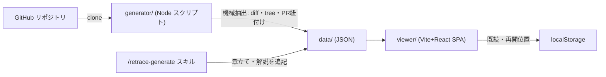

# retrace

**OSS のコミット履歴を、最初のコミットから順に「差分 ＋ LLM による意図の解説」付きで追体験する学習ツール。**

完成したコードは GitHub で読める。けれど「なぜその設計になったのか」——最初の一歩から積み上がる意思決定の連なりは、履歴に埋もれてしまう。retrace は、実在の OSS を `Initial commit` から 1 コミットずつ、**何を・なぜ・読みどころ**を辿りながら読み解ける。

🌐 **本番サイト → https://retrace-1ey.pages.dev**
🎬 **紹介ランディングページ → https://retrace-1ey.pages.dev/lp/a/**

> 設計・データスキーマの正は **[DESIGN.md](DESIGN.md)**。迷ったら DESIGN.md に従う。

---

## これは何か

- **1 コミットずつ、意図ごと読む** — 機械抽出した diff・ファイルツリー・PR に、LLM が書いた「意図の解説」を重ねる。決定的な抽出と、意図の言語化を分離した設計。
- **mainline を古い順に** — first-parent で辿る一本道を `Initial commit` から。分岐に迷わず、プロジェクトの背骨だけを順番に追える。
- **反ハルシネーション規律** — 解説は PR 本文・リンクされた issue を根拠に書き、根拠のない箇所は「おそらく」と明示する（evidence バッジ）。
- **ローカル完結** — 認証・共有・ホスティングなし。解説の生成は Claude Code のスキル内で完結し、API 従量課金は発生しない。進捗（既読・再開位置）はブラウザの localStorage に保存。

## 収録されている OSS

設計の型が学べる Go の実プロジェクトを厳選。**7 リポジトリ・計 1,524 コミット**、すべて章立て＋解説付き。

| リポジトリ | 言語 | コミット数 | 領域 |
|---|---|--:|---|
| [alecthomas/kong](https://github.com/alecthomas/kong) | Go | 491 | CLI パーサ |
| [julienschmidt/httprouter](https://github.com/julienschmidt/httprouter) | Go | 269 | HTTP ルーター |
| [nakabonne/ali](https://github.com/nakabonne/ali) | Go | 202 | 負荷試験 CLI |
| [cristalhq/aconfig](https://github.com/cristalhq/aconfig) | Go | 168 | 設定ライブラリ |
| [sourcegraph/conc](https://github.com/sourcegraph/conc) | Go | 153 | 並行処理 |
| [joho/godotenv](https://github.com/joho/godotenv) | Go | 129 | .env ローダ |
| [gothinkster/golang-gin-realworld-example-app](https://github.com/gothinkster/golang-gin-realworld-example-app) | Go | 112 | 実例アプリ |

## ビューアでできること

- **diff** — unified / split 表示、シンタックスハイライト、変更ファイルツリー
- **解説カード** — 各コミットの「何を・なぜ・読みどころ」＋言語固有の概念メモ＋根拠バッジ
- **章立て** — LLM が区切った章ごとに履歴をナビゲート
- **図解** — 解説に含まれる Mermaid 図をモーダル表示
- **手元で再現** — その時点の `git checkout` コマンドをワンクリックコピー
- **進捗** — コミット単位の既読管理（開いたら自動既読）＋最終閲覧位置から再開、リポジトリ切替

---

## クイックスタート

前提: **Node 20+** / **git** / **gh**（`gh auth status` が通っていること。PR/issue 取得に使用）。

```bash
make            # コマンド一覧を表示
make dev        # ビューアを起動(初回は自動で npm install)。data/ も配信される
```

`make dev` で起動したら、リポジトリを選んで `Initial commit` から追体験を始められる。

### 新しい題材 OSS を足す

```bash
make extract  REPO=<owner>/<repo>   # 1. 機械抽出(diff・tree・PR/issue 紐付け。再開可能・冪等)
make validate REPO=<owner>/<repo>   # 2. スキーマ検証 ＋ 統計
#                                     3. 章立て・解説生成は Claude Code 内で
```

Claude Code 内で「`<owner>/<repo>` を追加して」と頼めば、スキル **`retrace-add-repo`** が 1〜3（規模確認 → 抽出 → 検証 → 章立て・解説生成 → 閲覧開始）を一括実行する。既存データの解説だけ再生成するなら **`retrace-generate`**。

### その他のコマンド

```bash
make build      # ビューアをビルド(tsc + vite build → viewer/dist/)
make preview    # ビルド済みビューアをプレビュー起動
make test       # generator のユニットテスト
make fixture    # 開発用 fixture データセットを生成
```

---

## アーキテクチャ



**機械抽出（generator）と意図の言語化（LLM スキル）を分離**しているのが核。抽出は決定的に再生成でき、コストのかかる解説は `data/` に保全して git 管理する。

| パス | 役割 |
|---|---|
| `generator/` | 機械抽出（clone → mainline → diff/tree/PR 紐付け → JSON）。**Node 標準モジュールのみ・LLM 不使用・再開可能** |
| `data/<owner>__<repo>/` | 生成データ（`repo.json` / `index.json` / `chapters.json` / `commits/*.json`）。**git 管理**（解説はトークンコストがかかるため保全） |
| `.claude/` | ハーネス（skills / agents / rules / hooks）。**LLM を使う工程はここ経由のみ** |
| `viewer/` | Vite + React + TypeScript の静的 SPA。`data/` を fetch するだけ。既読・再開位置は localStorage |
| `viewer/public/lp/` | 紹介ランディングページ（A〜E の 5 デザイン案）＋埋め込み紹介動画 |

## スタック

- **generator** — Node 20+ 標準モジュールのみ（npm 依存ゼロ）。`git` と `gh` CLI で動く
- **viewer** — Vite + React + TypeScript（`tsc` strict がゲート）
- **紹介動画** — [HyperFrames](https://hyperframes.heygen.com/) で制作（`videos/`）。42 秒・音声なし字幕＋BGM
- **ホスティング** — Cloudflare Pages（`viewer/dist/` を配信。`data/` と LP・動画を同梱）

## デプロイ

```bash
make build
npx wrangler pages deploy viewer/dist --project-name=retrace --branch=main
```

> ビューアの本番ビルド（`dist/`）には `data/` が同梱される。ローカル閲覧は `make dev`（Vite の serveData ミドルウェアがリポジトリルートの `data/` を配信）が前提。

---

## ライセンス

[MIT](LICENSE)。収録している各 OSS のコード・コミットは、それぞれのリポジトリのライセンスに従う。
